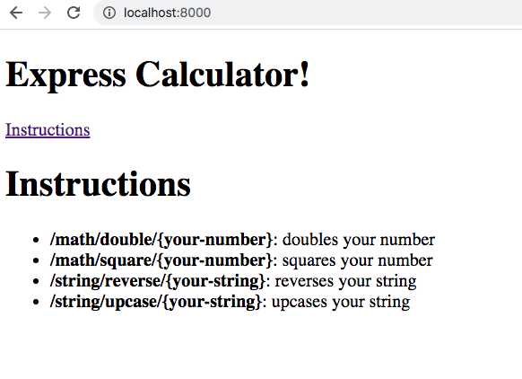
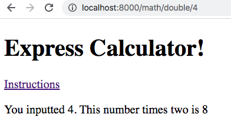
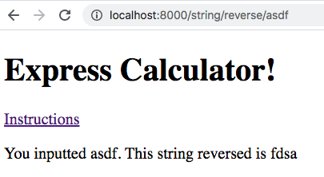
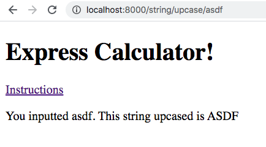

# Express calculator and SQLZoo2

## Part 1: Express Calculator
You will build an express app that performs some simple math and string calculations, based on the data the user inputs through the route parameters.

### Required behaviors:
1. When I visit the root of the app, I see a page like this:

1. When I visit `/math/double/<any-number>`, I see a page like this: 
1. When I visit `/math/square/<any-number>`, I see a page like this: 
1. When I visit `/string/reverse/<any-string>`, I see a page like this: 
1. When I visit `/string/upcase/<any-string>`, I see a page like this: 

### Your finished project should contain...
1. An express app that exhibits all the required behaviors. Your app should use the `express`, `ejs`, and `express-ejs-layouts` packages.
1. A `mathController` and a `stringController`, defined in their own files, and referenced in `index.js`
1. A `views` directory that contains a `math` and a `strings` directory, which each contain the appropriate ejs files
1. A layout that your views are rendered within. The layout should contain the header and the "Instructions" link, which should point to your root route.
1. Remember to NOT commit your `node_modules` directory!

